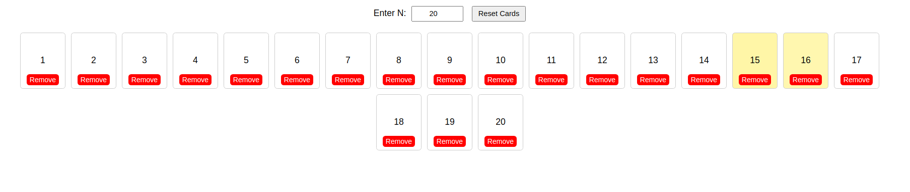

# React Card Game



## Tasks

- User should be able to input the number N
- Numbers from 1-N should be displayed in card format
- All the numbers except prime numbers should be highlighted with a different background color every 0.1 sec one by one
- When the user clicks one of the cards, find the maximum amount of other cards with a subtotal of the selected number. Could you make sure to select as many cards as possible to have the given subtotal? Those numbers should be flipped for 5 seconds and flipped numbers should be excluded from the loop.
- User should be able to remove the card and reset cards which will display cards from 1-N again.
- If subtotal not found for clicked card, then display error message and stop the loop for 3 seconds.

## Environment

- Ubuntu 22.04
- Node v22.12.0
- Npm 10.9.0

## Tech Stacks

- Vite + React + Typescript

## Steps to run program

1. Install node modules

   ```shell
   npm install
   ```

2. Run project
   ```shell
   npm run dev
   ```
   This will host the project on http://localhost:5173.
